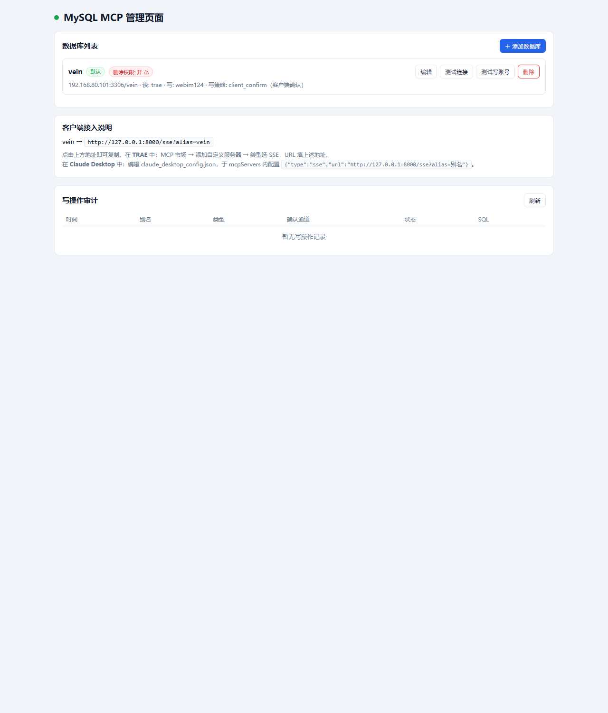
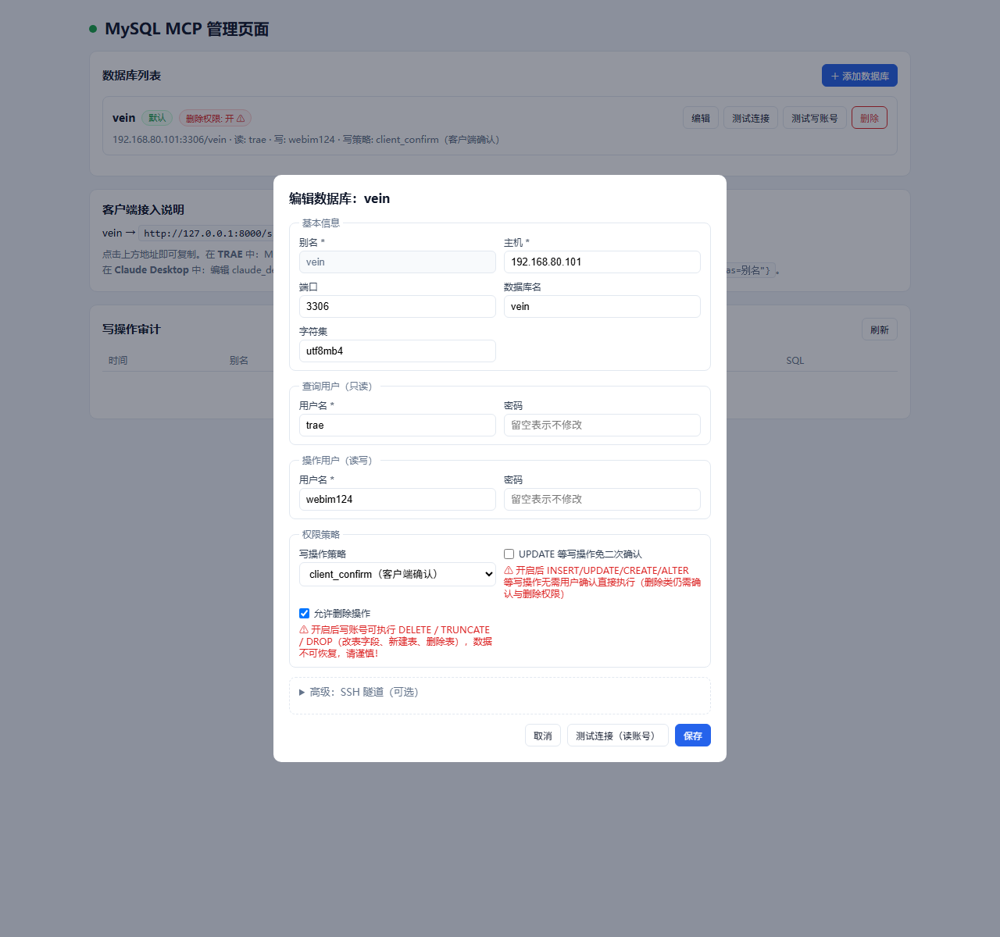

# MySQL MCP Server — 新增功能说明

本项目基于 [designcomputer/mysql_mcp_server](https://github.com/designcomputer/mysql_mcp_server) 二次开发。原有功能（工具、Prompts、环境变量配置等）请参考上游文档，**本文只介绍本仓库新增的功能**：

- **Web 管理页面** — 浏览器中管理多个数据库连接，无需改配置文件重启
- **多数据库别名** — 一个服务端同时服务多个库，客户端按别名接入
- **读/写双账号** — 查询走只读账号，写操作确认后走读写账号
- **SQL 三级判定** — 每条语句自动判定 读 / 写 / 删除
- **写操作双通道确认** — MCP elicitation 弹窗，或聊天内令牌二次确认
- **令牌冷静期** — 签发后 6 秒内不可使用，杜绝绕过用户确认
- **删除权限开关** — DELETE / TRUNCATE / DROP 默认拒绝，需显式开启
- **写免确认开关** — 可选让 INSERT / UPDATE 等写操作跳过二次确认
- **写操作审计** — 所有写操作尝试（含被拒）记录在页面与日志文件
- **达梦 DM8 支持** — 与 MySQL 并存，一个服务端可同时管理 MySQL 与达梦库（需安装 dmPython 驱动）
- **Linux 单文件部署** — 打包为不依赖 glibc 版本的静态可执行文件 + 启停脚本

## 快速开始

以 SSE 模式启动（管理页面与别名功能仅在 SSE 模式下可用）：

```bash
# Windows PowerShell
$env:MCP_TRANSPORT="sse"; $env:MCP_SSE_PORT="8000"; python -m mysql_mcp_server
# Linux/macOS
MCP_TRANSPORT=sse MCP_SSE_PORT=8000 python -m mysql_mcp_server
```

启动后打开管理页面：<http://127.0.0.1:8000/admin/>

## 管理页面



页面从上到下分为三个区域：

| 区域 | 功能 |
|---|---|
| 数据库列表 | 每个别名一张卡片：标记默认库、显示删除权限状态；操作按钮 **编辑**、**测试连接**（读账号）、**测试写账号**、**删除**；右上角 **＋ 添加数据库** |
| 客户端接入说明 | 自动生成每个别名的 SSE 接入地址，点击即复制，附 TRAE / Claude Desktop 配置指引 |
| 写操作审计 | 最近 100 条写操作记录（时间、别名、SQL 类型、确认通道、状态、SQL 摘要），可刷新 |

> **局域网访问**：管理页面默认仅限本机（回环）访问。设置环境变量 `ADMIN_TOKEN` 后，局域网客户端需在页面输入该令牌（或请求带 `X-Admin-Token` 头）才能访问。

## 数据库配置项

点击 **编辑**（或 **＋ 添加数据库**）打开配置表单：



| 配置项 | 说明 |
|---|---|
| 别名 | 客户端接入时 `?alias=` 使用的标识（创建后不可改） |
| 数据库类型 | `MySQL`（默认）或 `达梦 DM8`。达梦默认端口 5236，“数据库名”填模式名（schema），留空则列出可访问模式 |
| 主机 / 端口 / 数据库名 / 字符集 | 连接目标。数据库名留空即多数据库模式 |
| 查询用户（只读） | 执行 SELECT / SHOW / DESCRIBE / EXPLAIN 的账号 |
| 操作用户（读写） | 确认通过后执行 DML / DDL 的账号 |
| 写操作策略 | `client_confirm`（默认）：客户端不支持 elicitation 时，走聊天内令牌二次确认；`elicitation_only`：客户端无法展示服务端确认弹窗时直接拒绝写操作 |
| UPDATE 等写操作免二次确认 | 勾选后 INSERT / UPDATE / CREATE / ALTER 等写操作直接执行，不再弹确认（删除类仍需确认与删除权限） |
| 允许删除操作 | DELETE / TRUNCATE / DROP 的总开关，默认关闭。开启后操作账号可修改表字段、新建表、删除表，数据不可恢复 |
| SSH 隧道（高级） | 可选经由跳板机连接数据库 |

配置保存后立即生效：**新连接**直接使用新配置，已连接的会话需重连。密码在接口返回中始终以 `****` 脱敏，编辑时留空表示不修改。

配置持久化在 `config/databases.json`（可用 `MYSQL_MCP_CONFIG_DIR` 重定向）。当该文件没有任何条目时，自动回退为读取 `MYSQL_*` 环境变量的单库模式（读写同一账号），与上游行为兼容。

## 客户端接入

客户端 MCP 配置的 URL 格式：

```
http://<主机>:<端口>/sse?alias=<别名>
```

- 省略 `alias` 时使用默认别名
- **TRAE**：MCP 市场 → 添加自定义服务器 → 类型选 SSE，URL 填上述地址
- **Claude Desktop**：在 `claude_desktop_config.json` 的 `mcpServers` 中配置 `{"type":"sse","url":"http://主机:端口/sse?alias=别名"}`

## 写操作确认流程

服务端对每条 SQL 做三级判定：**读**（SELECT / SHOW / DESCRIBE / EXPLAIN）、**写**（INSERT / UPDATE / CREATE / ALTER 等）、**删除**（DELETE / TRUNCATE / DROP）。支持 CTE（`WITH ...`）取主语句关键字、剥离注释、`EXPLAIN ANALYZE` 按实际语句递归判定；无法判定的一律按写处理。

执行流程：

1. **读** → 直接用查询账号执行。
2. **删除** → 未开启「允许删除操作」直接拒绝；开启后进入与写相同的确认流程。
3. **写 / 删除**（未开免确认）→ 依次尝试两个确认通道：
   - **通道一：elicitation 弹窗** — 客户端支持 MCP elicitation 时，弹出服务端确认框展示完整 SQL，接受则用操作账号执行，拒绝则中止。
   - **通道二：聊天内令牌二次确认** — 客户端不支持 elicitation 时（按写策略降级）：
     1. 服务端返回 `confirm_token`，并提示 AI 向用户完整展示 SQL、征求同意；
     2. 用户同意后，AI 用**相同 query** 携带 `confirm_token` 重新调用 `execute_sql`；
     3. 令牌校验通过 → 用操作账号执行。
   - 令牌特性：一次性、5 分钟有效、绑定别名与 SQL；**签发后 6 秒内使用会被拒绝且令牌作废**（冷静期）——防止客户端拿到令牌后跳过用户确认立即执行，强制经过真实的用户授权环节。

4. **写**（开启免二次确认）→ 直接用操作账号执行，审计记录标记 `skip_confirm`。

## 达梦 DM8 支持

在管理页面添加数据库时选择数据库类型为 **达梦 DM8**，与 MySQL 库并存于同一服务端。安装驱动后即可使用：

```bash
pip install "mysql_mcp_server[dameng]"
# 或直接安装驱动
pip install dmPython
```

要点：

- 达梦默认端口 **5236**（表单留空端口时自动使用）；“数据库名”对应达梦的**模式名（schema）**，留空则进入多模式模式（列出可访问模式，过滤 SYS 等系统用户）
- 元数据查询走达梦数据字典：表列表 `USER_TABLES` / `ALL_TABLES`，列信息 `ALL_TAB_COLUMNS`（可空性 `Y/N` 自动对齐为 `YES/NO`），标识符使用双引号引用
- `execute_sql`、`get_schema_info`、`get_table_sample` 三个工具行为与 MySQL 一致（含三级判定、双通道确认、审计）；`alias` 参数同样支持别名与项目名称两种匹配
- 未安装 dmPython 时连接达梦条目会返回明确的安装提示，不影响 MySQL 条目正常使用
- 单文件打包（`build_remote.sh`）已包含 `--collect-all dmPython`，无需额外处理驱动动态库

## 写操作审计

所有写操作尝试（无论成功、被拒还是等待确认）都会记录：

- **管理页面**「写操作审计」表格实时查看（内存中最近 100 条）
- 磁盘文件 `logs/audit.log` 追加写入，格式：`时间 | 别名 | SQL类型 | 确认通道 | 状态 | SQL`

确认通道取值：`elicitation`（弹窗确认）、`token`（令牌确认）、`skip_confirm`（免确认执行）、`-`（未进入确认环节）；状态包含 `executed`、`pending_token`、`token_too_early`、`invalid_token`、`user_decline`、`rejected_delete_disabled`、`blocked_policy` 等。

## Linux 打包部署

提供一键脚本将服务打包为**单文件静态可执行程序**（staticx 静态化，不依赖目标机器 glibc 版本，CentOS 7 等老系统可直接运行）：

```bash
# 在 Linux 构建机上（需 python3 >= 3.11）
bash scripts/build_remote.sh
```

脚本完成：venv 隔离 → 安装依赖 → PyInstaller 打包（`--collect-all mysql` 收集 mysql-connector 运行时动态加载的认证插件与错误消息数据）→ staticx 静态化 → patchelf 清理 RPATH。产物在 `dist/` 下三个文件：

| 文件 | 用途 |
|---|---|
| `mysql_mcp_server` | 静态可执行文件（约 35MB） |
| `start.sh` | 启动脚本（后台运行，支持 `MCP_SSE_PORT` / `MCP_SSE_HOST` / `ADMIN_TOKEN` / `MYSQL_MCP_CONFIG_DIR` 环境变量覆盖，配置与日志固定在脚本同目录 `config/`、`logs/`） |
| `stop.sh` | 停止脚本 |

部署到目标服务器：

```bash
./start.sh    # 启动，输出管理页面与 SSE 地址
./stop.sh     # 停止
```

> 说明：若目标机器 glibc 版本与构建机一致或更新，也可用 `scripts/build.sh`（仅 PyInstaller、不做 staticx）产出体积更小的普通单文件。
